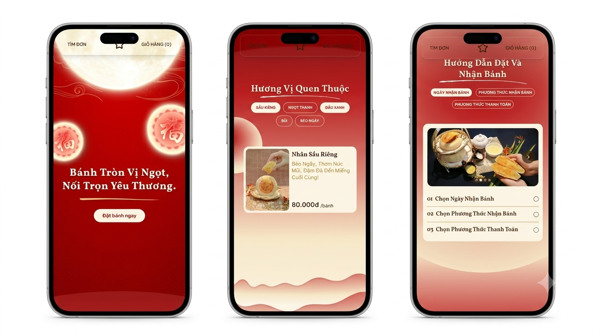
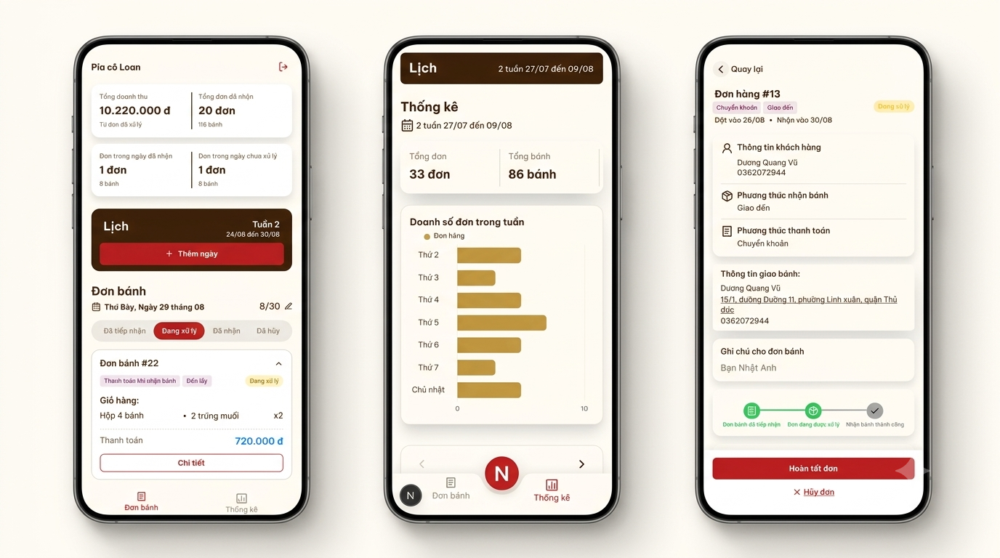
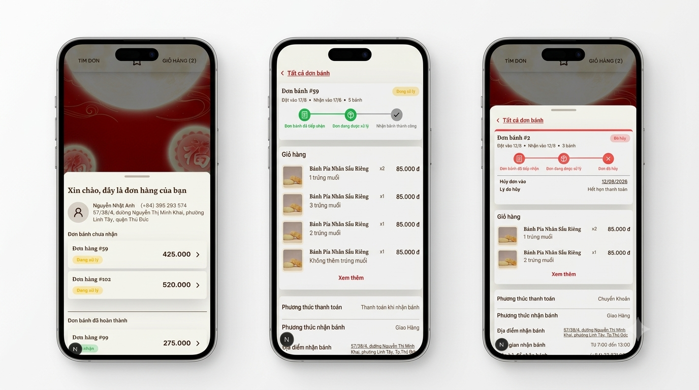
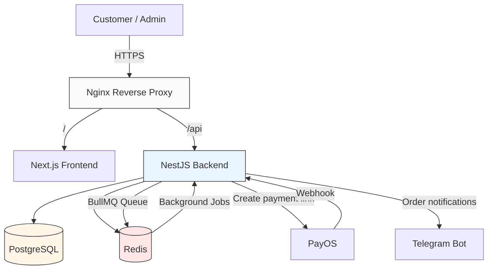

Banh Pía PMS is a sales management system for my mom’s bakery, the one she runs from home every Mid-Autumn season. It handles limited daily slot bookings, online payments through PayOS, and a simple dashboard so my mom can keep track of orders without getting overwhelmed during the busiest days.

This project was planned and built over 4 months alongside a designer. The goal was simple: reduce the chaos of peak season, make ordering easier for customers, and help my mom run the shop without having to manage everything manually.

The technical part was where the real challenge was. We had to handle the kinds of issues that show up in real life: preventing double-booking when multiple people try to reserve the same slot at the same time, making sure PayOS webhooks are not processed twice, and canceling expired orders without accidentally affecting orders that were already paid.




## Production

**[piacoloan.info](https://www.piacoloan.info)** — currently live and serving real customers.

> Available from **August 19** to **October 19, 2026** (seasonal operation, aligned with Mid-Autumn Festival demand).

## Highlights

- **Temporary slot reservation to prevent double-booking**
  Redis holds each time slot for 10 minutes, and the transaction uses row-level locking to make sure two customers cannot reserve the same slot at the exact same moment.

- **Online payment with PayOS**
  The system creates payment links, verifies PayOS webhook signatures, checks the exact transaction amount, and prevents duplicate processing when PayOS retries the webhook multiple times. This helps avoid duplicate notifications and repeated status updates after payment.

- **Automatic background tasks**
  BullMQ and Redis handle automatic cancellation of unpaid bank-transfer orders after 10 minutes, while releasing the reserved cake quantity back to stock. The logic is designed to avoid canceling an order that was just confirmed as paid.

- **A dashboard that is easy for non-technical people to use**
  Revenue, orders, best-selling products, and traffic are tracked by day and week. The system also helps manage daily cake output and overbooking in a way that keeps the customer experience smooth without sacrificing a little extra revenue. Everything was designed so my mom can operate it day by day without stress.

- **Security with JWT rotation**
  Access and refresh tokens, password hashing with bcrypt, and Redis-based token blacklisting make sure old tokens cannot still be used after logout or refresh. That reduces the risk if a token is leaked.




<details>
  <summary>See full features</summary>

  - Landing page, product listing, options for cake type, box size, salted egg count, and quantity
  - Temporary cart saved in localStorage with automatic expiration
  - Multi-step checkout: customer info, delivery/pickup, receive date, payment method
  - Order lookup by phone number, detailed order history, and status tracking
  - Order management: view, complete, cancel, and auto-release inventory
  - Production schedule management: create and adjust slot capacity by date

  
</details>

## System architecture



**Main flow:**
- The frontend (Next.js) and backend (NestJS) run separately and communicate through REST APIs, routed through an Nginx reverse proxy with HTTPS on a VPS.
- PostgreSQL stores transactional data like orders, customers, and products. Redis handles temporary slot holding, rate limiting, idempotency checks, JWT blacklisting, and acts as the backend for BullMQ background jobs such as automatic order cancellation and notifications.
- PayOS handles payment processing and sends a webhook when a transaction occurs. The backend verifies the signature before updating the order status.
- The Telegram bot sends real-time notifications to the admin whenever there is a new order or a successful payment.

## Technical Decisions (ADR)

Full write-ups in [`docs/ADR/`](./docs/ADR):

| ADR |          Problem           |                  Decision                |                                              Docs                                               |
|-----|----------------------------|------------------------------------------|-------------------------------------------------------------------------------------------------|
| 001 | Concurrent double-booking  | Pessimistic locking + overbooking buffer | [VI](./docs/ADR/001-concurrency-control-vi.md) · [EN](./docs/ADR/001-concurrency-control-en.md) |


## Tech Stack

**Backend**
- NestJS 11 — REST API, dependency injection, and domain-based modularization
- PostgreSQL 16 + Prisma ORM — transactional data and database-level integrity constraints
- Redis 7 — slot holding, rate limiting, idempotency, JWT blacklist, and BullMQ backend
- BullMQ — background jobs like automatic cancellation and notifications

**Frontend**
- Next.js 16 — App Router and production-ready standalone output

**Infrastructure**
- Docker & Docker Compose — service containerization
- Nginx — reverse proxy and HTTPS termination
- Self-managed VPS (Ubuntu 24.04 LTS)

**External integrations**
- PayOS — online payment and HMAC-verified webhooks
- Telegram Bot API — real-time order notifications

## Infrastructure & DevOps

The project is deployed and managed on a private VPS, with a setup that keeps things practical and reliable for a small family-run business.

- **Containerization**: Frontend, backend, PostgreSQL, and Redis are all run via Docker Compose, with service-specific healthchecks and a private internal network that keeps the database away from direct internet exposure.
- **Reverse proxy & HTTPS**: Nginx is configured to proxy traffic and automatically renew SSL certificates with Let’s Encrypt / Certbot.
- **Backup & disaster recovery**: Daily `pg_dump` backups are scheduled with cron, and the restore process has been tested in practice instead of only being created on paper.
- **Monitoring**: Docker healthchecks, external uptime monitoring, and log rotation help keep the system stable without the disk filling up unexpectedly.
- **Load testing**: The admin dashboard was tested with k6. The heaviest read endpoint reached p95 = 318ms and p99 = 341ms under 20 concurrent users, with 0% error rate.
- **Deployment**: A small automation flow handles pull → build → healthcheck, which reduces manual mistakes and makes releases less stressful.

> Full details about the deployment process: [DEPLOYMENT.md](./docs/DEPLOYMENT.md)

## Run the project

### Requirements
- Docker & Docker Compose
- Node.js 20+ (if you want to run without Docker)

### Run with Docker (recommended)

```bash
git clone https://github.com/N4thh/Banh-Pia-Pms.git
cd Banh-Pia-Pms
cp .env.example .env   # fill in the required environment variables
docker compose up -d
```

Access:
- Frontend: `http://localhost:3000`
- Backend API: `http://localhost:3001` for Docker/container mode, or `http://localhost:3002` for local development mode

### Required environment variables
- `DATABASE_URL`: PostgreSQL connection string
- `REDIS_HOST`, `REDIS_PORT`: Redis connection settings
- `JWT_AT_SECRET`, `JWT_RT_SECRET`: JWT signing secrets for access and refresh tokens
- `PAYOS_CLIENT_ID`, `PAYOS_API_KEY`, `PAYOS_CHECKSUM_KEY`: PayOS payment integration
- `TELEGRAM_BOT_TOKEN`, `TELEGRAM_CHAT_ID`: Telegram order notifications

### Run migrations and seed sample data

```bash
cd backend
npx prisma migrate dev
npx prisma db seed
```
