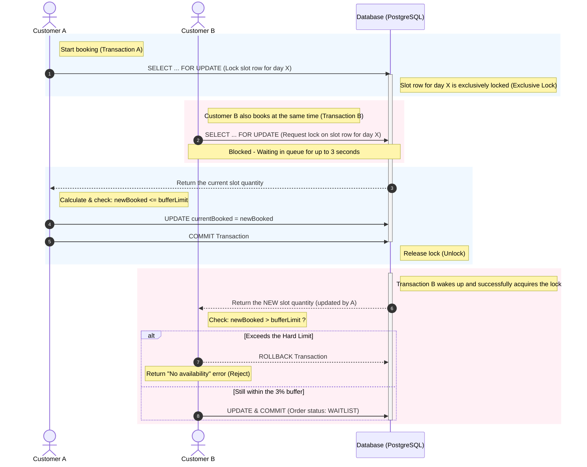

# ADR-[001]: Concurrency Control

**Date:** [07/09/2026]  
**Status:** [Implemented]

---

## 1. Context

How can we ensure that the system data remains accurate when multiple clients read/write almost simultaneously?

Even a difference of only a few milliseconds between Client A and Client B placing an order at nearly the same time can cause them to read different data states.

For example, when the system has only 1 cake slot remaining and Client A is the first to place an order, the system may still show the slot as available because the data has not been updated yet. However, when Client B places an order, Client A's request may still be in progress. As a result, Client B is also allowed to place an order, creating a double-booking situation - both clients receive a successful booking notification, both are charged, but in reality, the inventory is only sufficient for one customer.

### Answer:

- We need to ensure that, at any given time, only one client can read and write the relevant system data. Therefore, I decided to use **pessimistic locking** for this situation.
- At the same time, we combine this with **over-booking** by adding a `bufferLimit = maxQuantity + 3% * maxQuantity` (`softLimit`) - the total number of cakes entered by the admin each day. This helps make the system less rigid, improve the user experience, and potentially generate a small amount of additional revenue from this 3% buffer. Why 3%? Because this is the maximum over-sell risk that the bakery can still handle manually.
- Completely prevent over-booking by rejecting the order immediately if the booking quantity exceeds `bufferLimit`.

---

## 2. Options Considered

| Option | Advantages | Disadvantages | Why Not Chosen |
|------------|----------|----------|----------|
| **A: Atomic Update Statement** | No additional locking mechanism is required; uses a conditional `UPDATE` statement. | It is not possible to safely combine the `bufferLimit` validation into a single atomic statement - for this problem, we need to ensure that the number of customer bookings is `<= bufferLimit`, and multiple updates cannot guarantee this. | Does not solve the problem. |
| **B: Optimistic Locking** | No client has to wait. Improves the user experience. | When the Client starts writing data to the system, the data is not guaranteed to still be correct at that point. | Only suitable for functions that require reading and little or no writing, so it is not suitable for this problem. |
| **C: Pessimistic Locking** | Creates a queue - when Client A starts the session, Client B has to wait for its turn. This reduces the user experience. | Ensures that the data remains consistent from the time the client starts reading until it writes. When Client B starts, it will read the latest data after Client A has finished reading and writing. | — |

---

## 3. Decision

**Selected:** Wrap the read–check–write operations in a transaction and use **Pessimistic Locking - `SELECT FOR UPDATE`**.

- Ensures data consistency when multiple clients read/write concurrently, making it highly suitable for the inventory protection problem described above.
- Since the time difference between A and B is only a few milliseconds, the time B has to wait in the queue is negligible.

---

## 4. Trade-offs & Limitations

- The main trade-off is a small amount of latency (a few ms to a few hundred ms) for Client B in exchange for ensuring that double-booking does not occur - this is acceptable because simultaneous booking attempts are rare.
- If the bakery has 2 or more types of cakes, the implementation above will break down completely because each session is wrapped in a transaction - ensuring that all operations inside the transaction are completed before it is committed. However, when protecting the inventory for 2 or more types of cakes with different quantities, this could create an infinite waiting cycle where one request waits for another request.
- Why not improve the above problem by sorting the IDs in ascending or descending order to ensure that requests arriving at the same time only wait for the same cake slot to finish processing? Since my mother's bakery currently sells only one type of cake, I decided not to implement this **ordered-locking** solution in order to save time and avoid over-engineering. I will consider applying it if the bakery sells other types of cakes in the future.

---

## 5. What I'd Do Differently

If I were to do it again, I would write an integration test to simulate 2 concurrent requests (using `Promise.all` to call the API twice at the same time) to automatically verify that the race condition is actually prevented, rather than relying only on the theory behind `SELECT FOR UPDATE`.