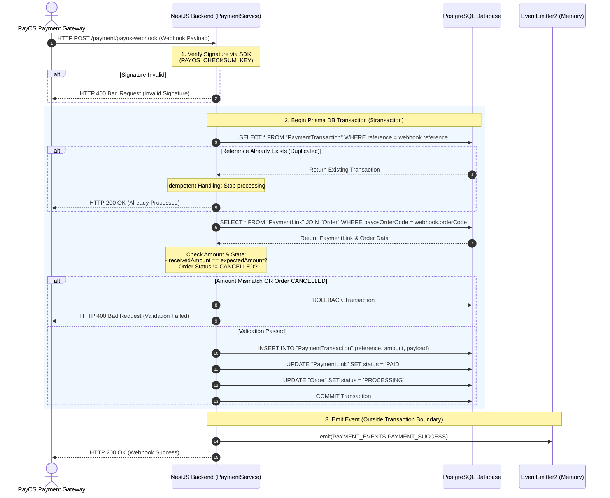

# ADR-002: Payment Webhook Security

**Date:** 09/09/2026
**Status:** Applied

---

## 1. Context

This problem came up while processing the information sent back from PayOS's webhook. The issue is that the system had no way to verify whether the webhook data it received actually came from PayOS, or from someone pretending to be PayOS.

If webhook information is not authenticated, this can lead to several consequences:

- It opens a gap for a hacker to send a fake notification claiming an order has been paid successfully, when in reality no money was received — this creates incorrect order data and causes the bakery to lose revenue without the system ever knowing.
- Or, in a more sophisticated attack, someone could forge PayOS's signature to pay a smaller amount than the actual amount owed.
- When a network issue causes PayOS to send the same webhook twice, this creates a duplicate-processing situation.

---

## 2. Options Considered

| Option | Pros | Cons | Why not chosen |
|---|---|---|---|
| **A: Fully trust PayOS** | No complex code needed | Opens up many opportunities for a hacker, or even a simulated request from Postman, to be accepted | Does not guarantee security |
| **B: Use Idempotency** | Solves the duplication problem when PayOS sends repeated webhook requests | Cannot verify whether the sender is actually PayOS | Does not fully solve the problem at hand |
| **C: Combine SDK signature verification with a DB transaction** | Ensures information security. Establishes trust between the webhook from PayOS and the system. Also allows strict verification of the webhook data against the Transaction DB | Higher implementation complexity than the two options above | — |

---

## 3. Decision

In the end, I chose the option of using PayOS's SDK to verify the signature — something only my system and PayOS know. I also wrapped the following checks inside a transaction: checking for duplication, comparing the amount paid from the webhook against the actual amount owed on the order, and checking the order's status to see whether it's re-checking an order that has already been processed.

**Core reasoning:**
- Meets the security requirements that were set out for the system from the start.
- Ensures the bakery's revenue is not lost.
- Leaves no opportunity for a hacker to attack the system.

**Mermaid:**

---

## 4. Trade-offs & Limitations

- **Currency precision:** Needs an analysis of the limitations of the Number data type and a direction for standardizing it.
- **Under what condition the system will definitely "break":** When PayOS retries the webhook and sends 2 nearly simultaneous requests, the system cannot yet handle this case: if the second request arrives before the first request's transaction has finished committing, duplicate processing can still occur. Even though there is a unique constraint blocking it at the DB layer, there is no row-level lock in place right when the first request begins its transaction — so there is still a race window before the constraint gets checked.
- **Consistency of event emission:** The Telegram event emission (PAYMENT_SUCCESS) is placed outside the transaction. If the server crashes right after writing to the DB but before the event is sent — this is a limitation of not yet using the Outbox Pattern.
- Additionally, my current system only checks for the "PROCESSING" status and does not yet have a handling path for the "CANCELLED" status.

---

## 5. What I'd do differently

- If I did this again, I would look more carefully into currency precision.
- If I had more time, I would study the Outbox Pattern more so that no event ever gets lost.
