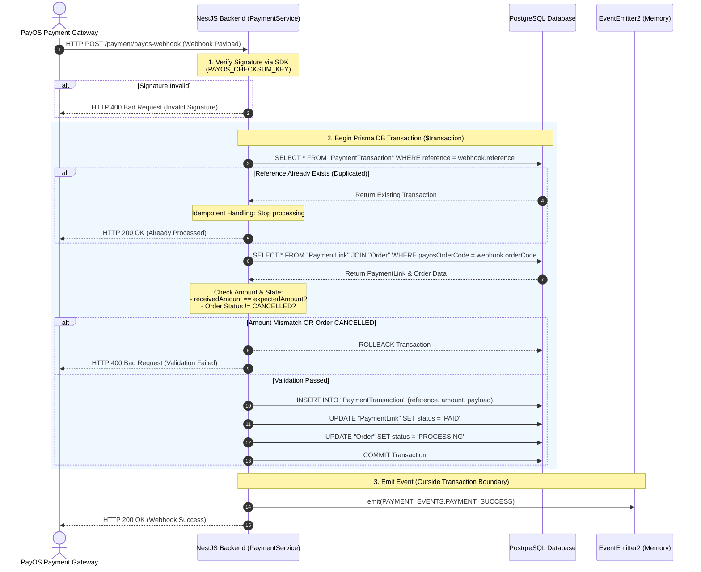

# ADR-002: Payment Webhook Security

**Ngày viết:** 09/09/2026
**Trạng thái:** Đã áp dụng

---

## 1. Context (Bối cảnh)

Bài toán xuất hiện trong quá trình lấy thông tin từ webhook của PayOS gửi về. Vấn đề là hệ thống không có cách nào xác minh dữ liệu webhook nhận về thực sự đến từ PayOS, hay do ai đó giả mạo.

Việc thông tin từ webhook không được xác thực sẽ tạo ra nhiều hậu quả như:

- Tạo sơ hở cho hacker gửi thông báo giả rằng đơn hàng đã thanh toán thành công dù thực tế chưa có tiền vào, gây sai lệch dữ liệu đơn hàng và làm mất doanh thu của tiệm bánh mà hệ thống không hề biết.
- Hoặc tinh vi hơn là làm giả chữ ký của PayOS để thanh toán với số tiền nhỏ hơn so với số tiền thực tế phải trả.
- Khi có sự cố mạng, khiến cho PayOS gửi webhook hai lần tạo nên việc trùng lặp.

---

## 2. Options Considered

| Phương án | Ưu điểm | Nhược điểm | Vì sao không chọn |
|---|---|---|---|
| **A: Tin tưởng tuyệt đối từ PayOS** | Không phải code phức tạp | Tạo nhiều cơ hội cho hacker hoặc Postman giả lập cũng được | Không đảm bảo về tính an toàn bảo mật |
| **B: Sử dụng Idempotency** | Giải quyết được vấn đề trùng lặp khi PayOS gửi yêu cầu webhook | Không verify được nơi gửi có phải là PayOS hay không | Chưa giải quyết triệt để bài toán đặt ra |
| **C: Kết hợp xác thực chữ ký SDK và Transaction DB** | Đảm bảo về an toàn thông tin. Tạo nên sự tin tưởng giữa webhook từ PayOS và hệ thống. Đồng thời có thể verify các data từ webhook một cách chặt chẽ ở trong Transaction DB | Độ phức tạp cài đặt cao hơn 2 phương án trên | — |

---

## 3. Decision (Quyết định)

Cuối cùng tôi đã chọn phương án sử dụng SDK của PayOS verify chữ ký mà chỉ hệ thống của tôi và PayOS biết. Đồng thời bọc các verify sau trong transaction: kiểm tra duplicated, so sánh số tiền đã thanh toán từ webhook và số tiền thực tế phải thanh toán ở đơn hàng, kiểm tra xem status đơn hàng xem có phải đang check lại một đơn hàng đã xử lý rồi hay không.

**Lý do cốt lõi:**
- Đáp ứng đúng yêu cầu bảo mật đã đặt ra ngay từ đầu cho hệ thống.
- Đảm bảo doanh thu của tiệm bánh không bị thất thoát.
- Không tạo cơ hội cho hacker tấn công hệ thống.

**Mermaid:**

---

## 4. Trade-offs & Limitations (Đánh đổi và giới hạn)

- **Độ chính xác của tiền tệ:** Phân tích hạn chế về kiểu dữ liệu của Number và hướng giải quyết chuẩn hóa.
- **Ở tình huống nào hệ thống chắc chắn sẽ "gãy":** Khi PayOS gửi retry webhook 2 request gần như là đồng nhất, thì hệ thống chưa xử lý được: nếu request thứ hai đến trước khi transaction của request đầu commit xong, vẫn có thể xảy ra xử lý trùng lặp. Dù có unique constraint chặn ở tầng DB, nhưng chưa có row-level lock ngay khi request đầu tiên bắt đầu transaction — nên vẫn tồn tại khoảng hở thời gian trước khi constraint được kiểm tra.
- **Tính nhất quán trong việc phát event:** Đặt việc phát event ra Telegram nằm ngoài transaction (PAYMENT_SUCCESS). Nếu sever crash vào lúc ghi vào DB nhưng event chưa được gửi đi — giới hạn của việc chưa sử dụng Outbox Pattern.
- Ngoài ra ở hệ thống hiện tại của tôi chỉ kiểm tra nếu ra status là "PROCESSING" chưa có phần giải quyết nếu status là "CANCELLED".

---

## 5. What I'd do differently

- Nếu được làm lại tôi sẽ kiểm tra kỹ hơn về độ chính xác của tiền tệ.
- Khi được làm lại tôi sẽ có nhiều thời gian hơn để tìm học hỏi về Outbox Pattern để không một event nào bị bỏ sót.
